# Bing Image Creatorで巡るSNSの旅

この記事は、2023年の[Blueskyアドベントカレンダー](https://adventar.org/calendars/9443)の12月20日のために執筆されました。ゆるい気持ちで読んでみてください。19日の記事は[hakkadaikonさん](https://bsky.app/profile/hakkadaikon.bsky.social)の[Nostr/Bluesky活動年表を作ったので、Blueskyでの活動を振り返ってみる](https://zenn.dev/hakkadaikon/articles/6226ab87529277)でした。

### [Bing Image Creator](https://www.bing.com/images/create)とは？

この記事の趣旨について先に申し上げておきますと、「BingのImage Creatorを使って、私が想像しているSNSの世界観を一緒に見て回らないか？」です。Bing Image Creatorとは、Microsoft社が手掛ける画像生成AIサービスです。無料で利用でき、成果物のクオリティもかなり高いです。DALL·E3という生成AIを使用しています。

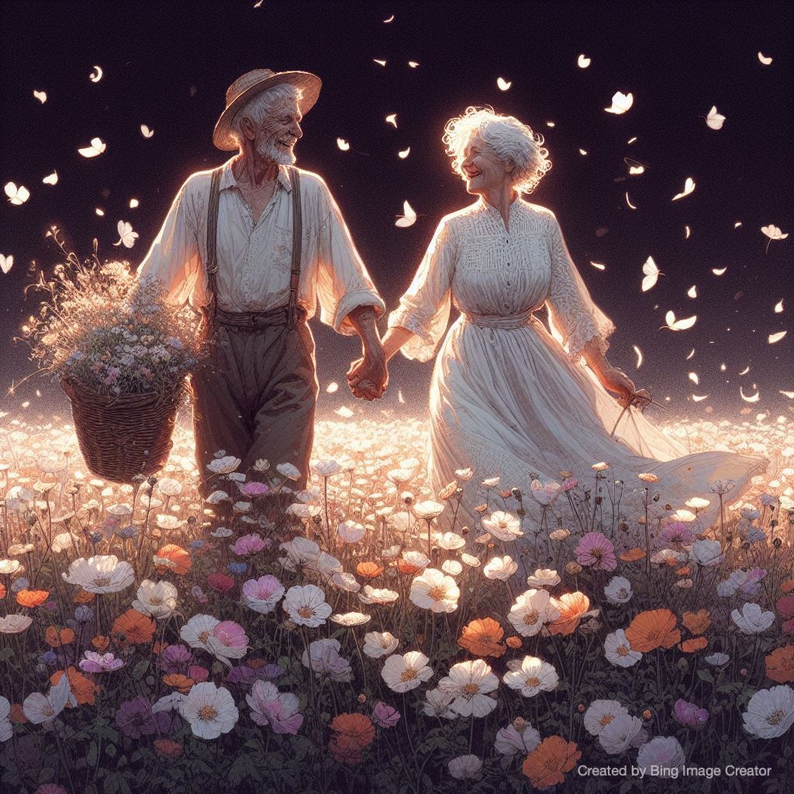
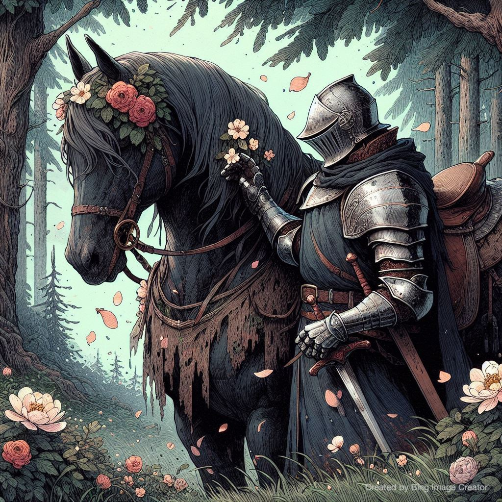
上記のような画像を出力することができるサービスです。

※この記事の画像はすべてBing Image Creatorで生成された画像です。

## 2022-2023年、Twitterは終わりを迎えた

さて、みなさんもご存知であろうお話です。 
Elon Musk氏のTwitter買収、凍結騒ぎ、Xへの転身、課金集客体制の強化、などなど2022年から2023年にかけて「かつてTwitterであったSNS」は変貌を遂げました。特に日本は、Twitterのシェア率が高い国であったので、多くの人が影響を受けたことでしょう。

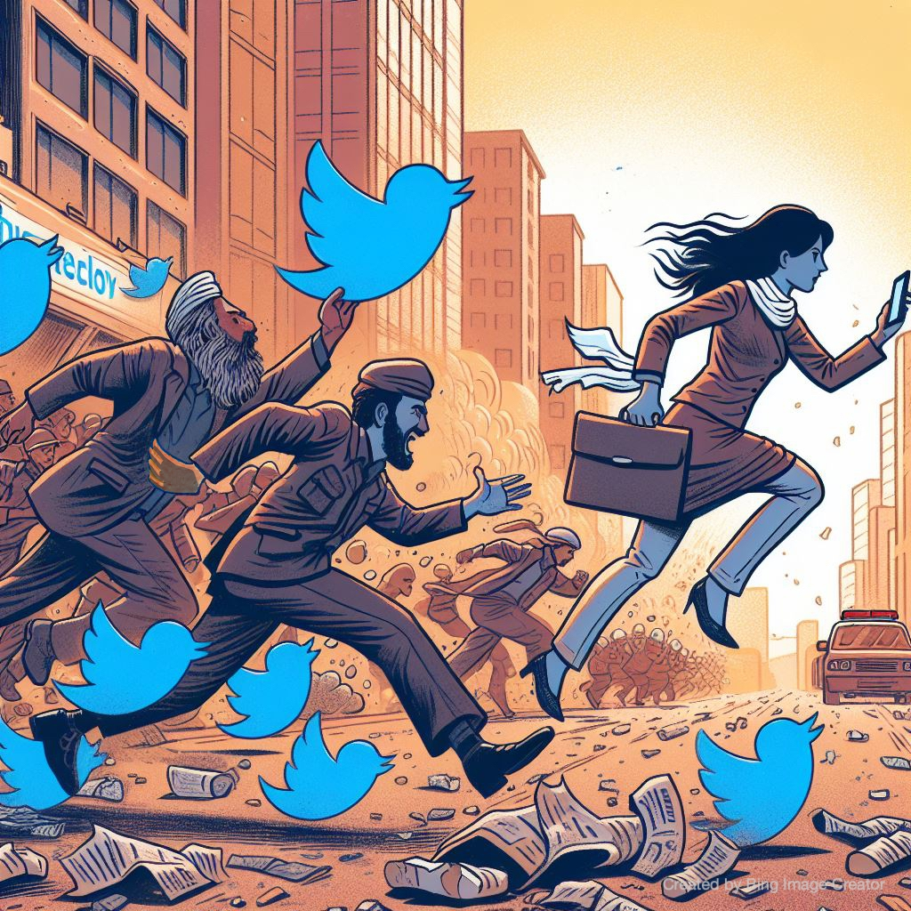

これを契機に、インターネットでは群雄割拠の新興SNS戦国時代を迎えることとなります。挙げるとキリがないので、めぼしいところをピックアップするならば、ActivityPubの雄Mastodon、日本人避難者が殺到し法人化もしたMisskey.ioを擁するMisskey、Twitterの後釜を狙ってか？資金力のあるMetaが突如立ち上げたThreads、日本人技術者によって生み出されたタイッツー、そしてまったく新しいプロトコルを使用したBluesky、といったところでしょうか。 
これらのSNSのうち三つ（＋おまけ）を、私が持つイメージをBing Image Creatorに作ってもらおうと思います！

## Bluesky

今までモチーフに一貫性が乏しいような気がしていたBlueskyです。元々Twitterのプロジェクトとして立ち上げられたはずのこのSNS（プロトコル）は、名前は青空という。鳥（Twitter）が飛ぶための空というコンセプトなのかと思っていました。ところが、分割したPDS名はなぜかきのこ。SNS名に沿って星座とか天体関係の名前にしないの？と思いましたが。正式なアイコンが蝶に決まったらしい…ということで、何となく私の中でBlueskyの世界観が見えました。

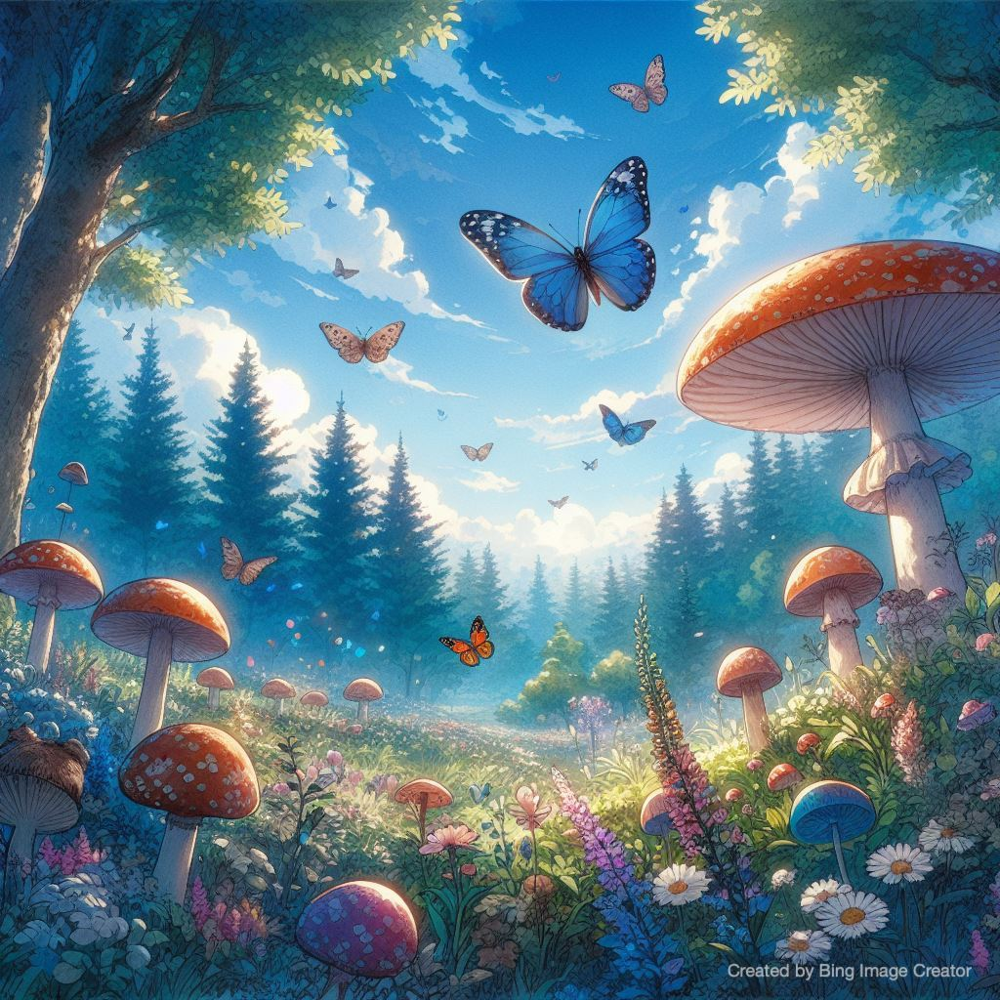
青い空、木陰に生い茂るきのこ、花に集まる蝶たち。何というかこう…ボタニカルでファンタジーな雰囲気を感じました。蝶は転じて妖精さんでもいいと思います。

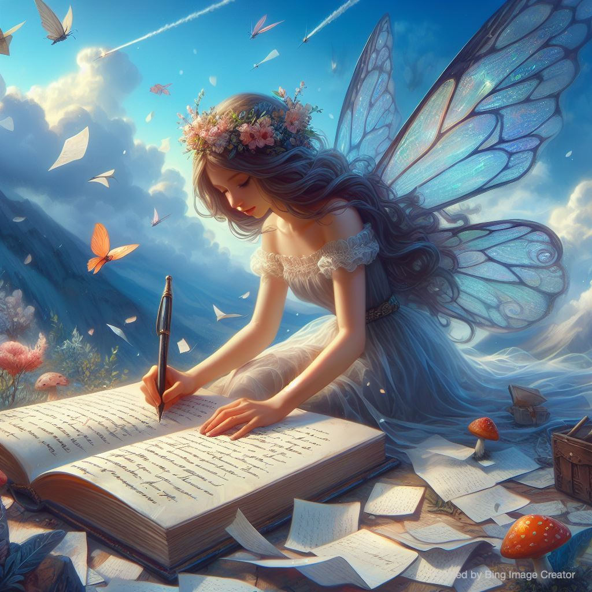
そう、我々は妖精さんだったのかもしれない…。（投稿中の我々の姿）

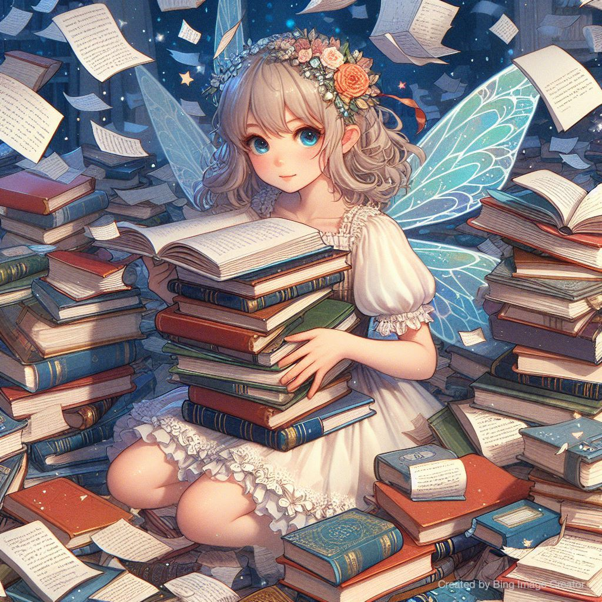
妖精さんが図書館（フィード）に本（投稿）を運んでいくところ。

ファンタジーなSNS…いいじゃないですか。私は好きです。 
虫が苦手なので妖精さんで脳内変換させてもらいました。 
割愛しますが他にも、青空への扉を鍵（招待状）で開けたり、盾で身を守る（ブロック機能）冒険者の姿を想像しました。Blueskyはゲーマーに夢を与えてくれるSNSかもしれません。

## Mastdon

Mastodonはマストドン（マンモス）のイメージが強すぎてそれしか考えられなかったですね。 
昔のMastodonって牧歌的な雰囲気があったと思うのですが、最近の話をMastodon界隈の方に聞くと結構「紛争」とか「戦争」のワードが飛び出してくるので、意外と今は殺伐としているのかもしれない…？（あまりMastodonを見ないのでわかりません教えて偉い人） 
サーバーもたくさんありますし、「サーバーによる」が適切な表現なのでしょう。

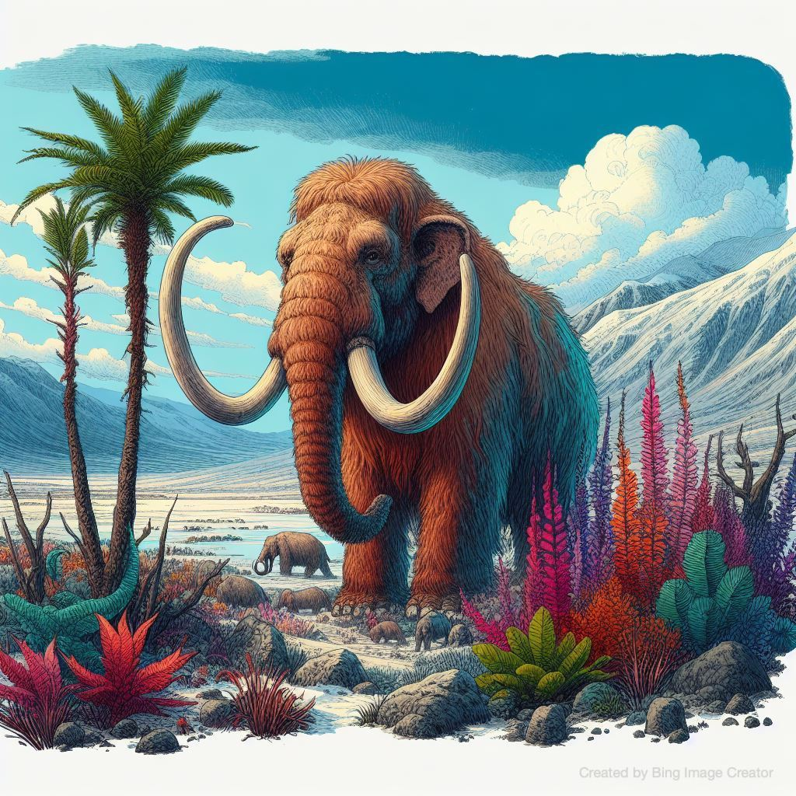
牧歌的な頃のMastodon。

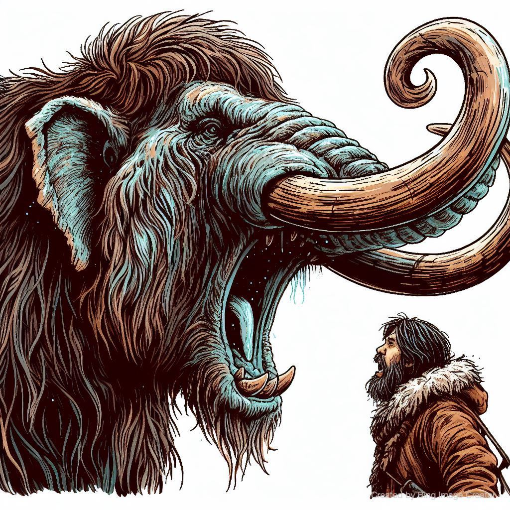
紛争が起きているMastodon。

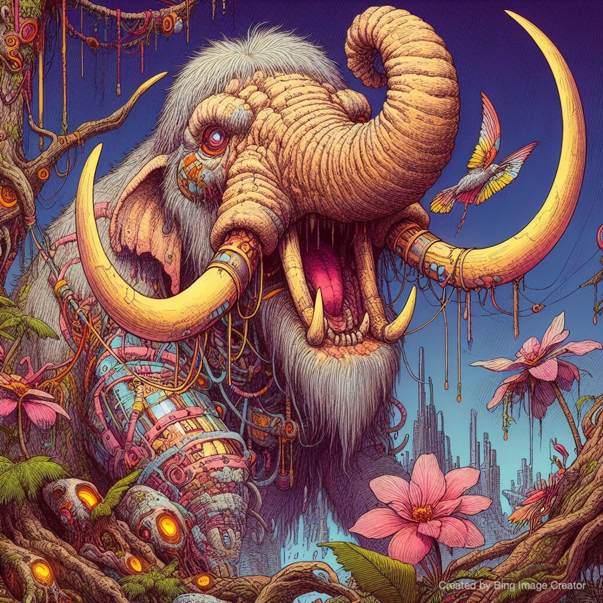
あと、昔も今も開発者さんのいるイメージが強いです。分散型で必ずサーバーを建てる人が必要になるので自然と類は友を呼ぶのでしょうか。（プロンプトにサイバーパンクのイメージを付与）

## Misskey

先に謝っておきますが、Misskeyはアカウントを作っておりません。触ったことがないのにイメージだけ語らせていただきます。そして、ほぼMisskey.ioの想定になります。

さて、まず真っ先に出てくるMisskeyといえば何？ 
もちろん、絵文字リアクション！絵文字リアクション！そして絵文字リアクション〜！
恐らくみなさんの頭の中には「偉業」「レターパックで現金送れ」「はすべて詐欺です」「与謝野晶子」がよぎったことでしょう。いくらMisskeyを触ったことがないとはいえ私でも知っています。 
今は以前よりも落ち着いてきたと聞きますが、それでも絵文字リアクションの威力は健在です。昔は、Misskeyのことをネオン街や繁華街と表現していたのですが、今はちょっと違うような気がしています。（いや、でも絵文字リアクションはさながらネオン看板なんだよな） 
それは、絵描きさんたちが多い割合で定着したらしいということです。（全部伝聞系ですみません） 
となると、かなり華やかで楽しい場所であることは間違いない！これは、遊園地だな！…ということで私の中のMisskeyはこんな感じですね。

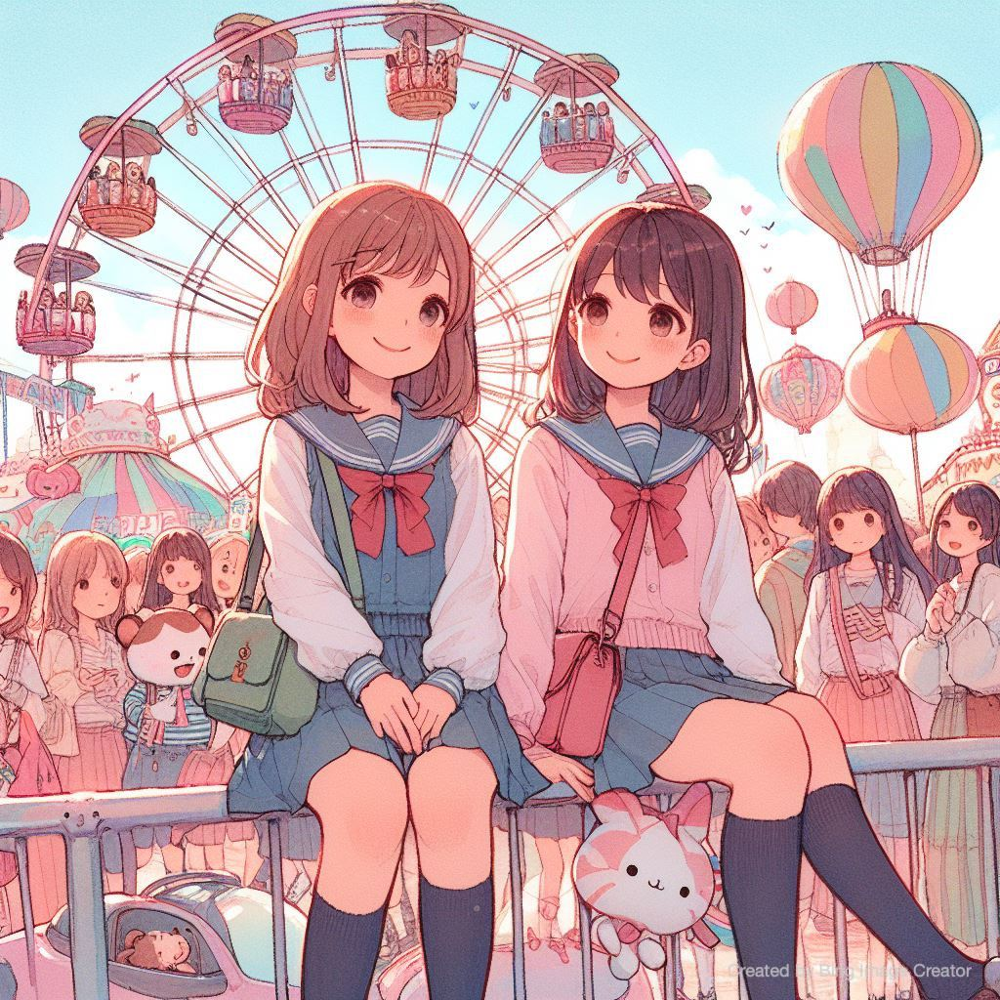
AI生成あるあるですがモブの顔がテキトーになりがち。

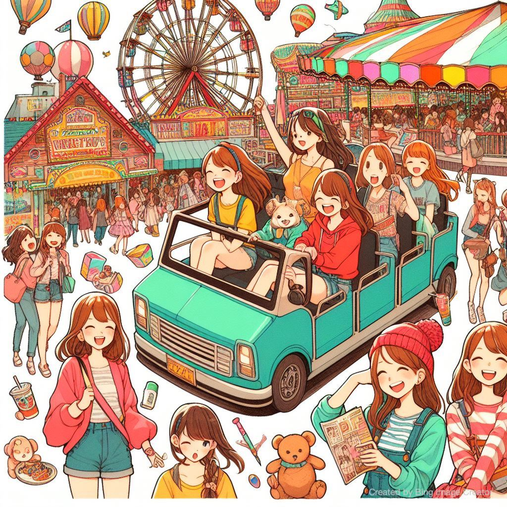
学生のキャッキャした若々しい空気感も遊園地に合っているのではないでしょうか。

## おまけ：初めて私が足を踏み入れた新興SNSはNostrでした

今年の2月3日、Twitterの行く先に不安を感じていた私が、SNSについてTwitterで検索したところ、Damusというクライアントについてのツイートが目に入りました。軽い気持ちで入れたそのクライアントは、Nostrというプロトコルを使用したSNS（として利用できるようにしたアプリ）でありました。みんなで一から居場所を開拓していく感覚が非常に楽しくて、二か月ほど夢中で会話を楽しみました。 
Nostrに足を踏み入れる前から私の最終目的地はBlueskyであり、約束の地でした。無事にBlueskyへ入れたあとも結局はBlueskyに留まることとなりましたが、このNostrでの二か月半は決して忘れません。 
[招待コードもNostrでの交友があったおかげで手に入れることができました。](https://nosli.vercel.app/li/naddr1qqf8wetvvdhk6efdw3hj6cnvw4jhx6meqgs0gzpjuf436yhc5fm30dsxn946aa5tcjmtsmz2xh9gylm0hjl4z8srqsqqqa28jv47ra)

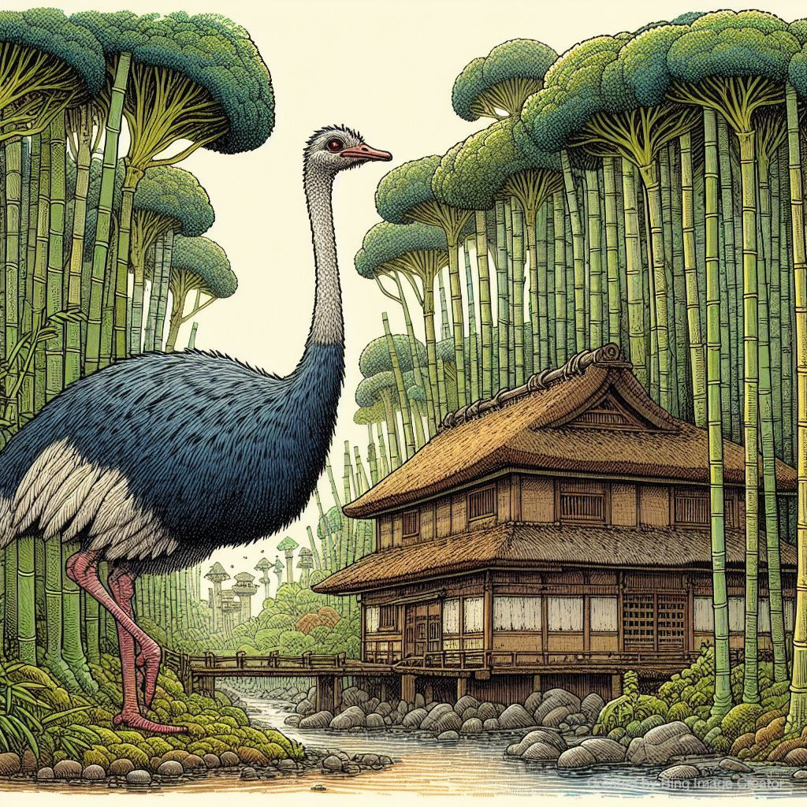
ちなみに、私がまだいた頃のNostrの日本語コミュニティはこんな感じ（をイメージする場所）でした。竹とブロッコリーと、その二つを交雑させた植物である竹ッコリーがミーム化したため、それらの生い茂る森の中に村があり、ダチョウが生息しているカオスな場所です。他にもいろいろあったような気がしますが割愛します！

## みなさんもBing Image Creatorで遊んでみて！

人間が描いたわけではない画像生成AIが好きでない方もいらっしゃることでしょう。
私は、趣味で絵を描く人間です。自分の手で絵を描くことは楽しい。完成することだけではない、描いている過程が楽しいのです。 
絵を描く人も描かない人も、生成AIは一度触れてみたらいいのではないのかなと思っています。AIイラストは人間が描くのとはまた違った楽しさがあるからです。
短時間で視覚的にインスピレーションを与えてくれるので、想像が膨らみやすく絵本を読んでいるような気分になります。 
Bing Image CreatorはMicrosoftのアカウントさえあれば無料な上、日本語で楽しめるので手軽に画像生成AIに触れられますので、おすすめです。

SNSより生成AIの話になってしまいましたが、みなさんの中の各SNSの雰囲気や世界観を教えてくれたら嬉しいです！
